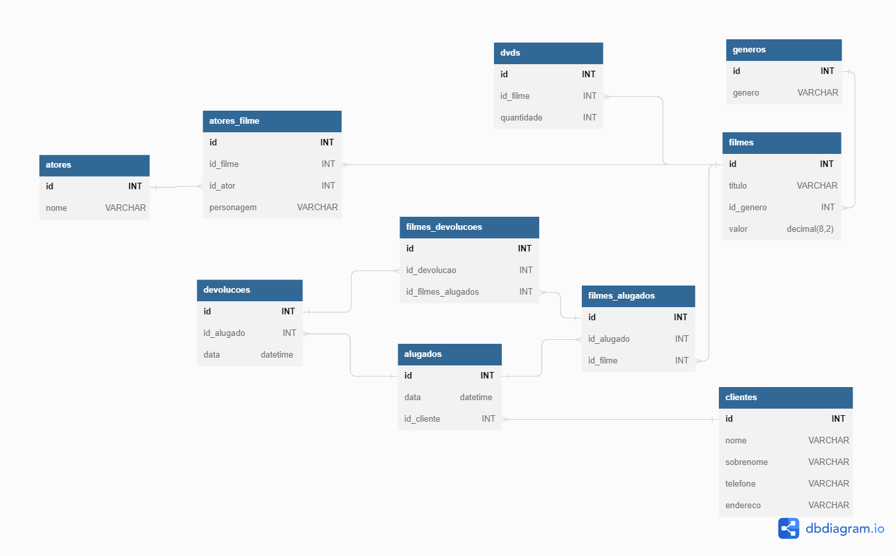

# Banco de Dados para locadora


Este repositório existe somente para fins de estudo.

Banco de Dados para Locadoras implementado no PostgreSQL e modelado
no [DbDiagram.io](https://dbdiagram.io/)

```postgresql
SELECT postgresql FROM conhecimentos_sql;
```

### Modelagem



### Exemplos de consultas

> Todos os resultados estão em csv no diretório:
> 
>data_querys/results

#### Devoluções
| Id Devolução | Cliente | Data da Devolução | Filme |
| :--- | :--- | :--- | :--- |
| 1 | Edson Pimenta | 2022-10-25 | Tomb Raider |
| 2 | Silvana Miranda | 2022-10-20 | Cidade Perdida |
| 3 | Helena Souza | 2022-10-26 | Manchester à Beira Mar |

#### O que cada cliente alugou
| Código | Cliente | Data | Filme | Gênero | Data |
| :--- | :--- | :--- | :--- | :--- | :--- |
| 1 | Edson Pimenta | 2022-10-22 | Tomb Raider | Fantasia | 2022-10-22 |
| 2 | Silvana Miranda | 2022-10-12 | Cidade Perdida | Comédia | 2022-10-12 |
| 3 | Helena Souza | 2022-10-25 | Manchester à Beira Mar | Drama | 2022-10-25 |

#### Quanto cada cliente pagou
| id | Cliente | sum |
| :--- | :--- | :--- |
| 1 | Edson Pimenta | 8.99 |
| 2 | Silvana Miranda | 6.99 |
| 3 | Helena Souza | 11.99 |


---

#### Contato:

[LinkedIn](https://www.linkedin.com/in/eeddyyxxyy/ "Para contato profissional")

[Currículo Online](https://eddyyxxyy.github.io/#home "Realizado no curso de Git e Github: Essencial")
